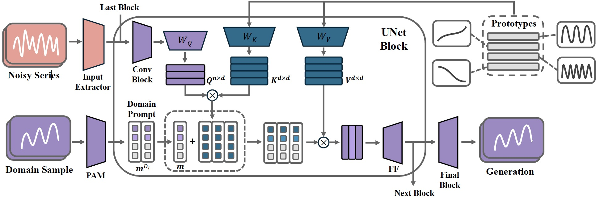

# TimeDP: Learning to Generate Multi-Domain Time Series with Domain Prompts
In TimeDP, we utilize a time series semantic prototype module which defines time series prototypes to represent time series basis, each prototype vector serving as "word" representing some elementary time series feature. 
A prototype assignment module (PAM) is applied to extract the extract domain specific prototype weights, for learning domain prompts as generation condition.
During sampling, we extract "domain prompt" with few-shot samples from the target domain and use the domain prompts as condition to generate time series samples.
Experiments demonstrate that our method outperforms baselines to provide the state-of-the-art in-domain generation quality and strong unseen domain generation capability. 


Figure: Overview of TimeDP model.

For more details, please refer to our paper [TimeDP: Learning to Generate Multi-Domain Time Series with Domain Prompts](https://arxiv.org/abs/2501.05403). 

## Quick Start

### Environment Setup

We recommend using conda as environment manager:
```bash
conda env create -f environment.yml
```

### Data Preparation
Pre-processed dataset can be found with this [link](https://huggingface.co/datasets/YukhoW/TimeDP-Data/blob/main/TimeDP-Data.zip). Set `DATA_ROOT` environment variable to the path of the dataset, or manually modify the `data_path_dict` in `configs/multi_domain_timedp.yaml` to reflect the correct path.

Use `main_train.py` for model training and `visualize.py` for domain prompt visualization. The detailed descriptions about command line arguments are as follows:
| Parameter Name                    | Description                                                                                                        |
| --------------------------------- | ------------------------------------------------------------------------------------------------------------------ |
| `base` (`-b`)                     | Paths to base configuration files.                                                                                 |
| `train` (`-t`)                    | Boolean flag to enable training. (default: true)                                                                   |
| `debug` (`-d`)                    | Boolean flag to enter debug mode. (default: false)                                                                 |
| `seed` (`-s`)                     | Seed for initializing random number generators. (default: 23)                                                      |
| `logdir` (`-l`)                   | Directory for logging data. (default: ./logs)                                                                      |
| `seq_len` (`-sl`)                 | Sequence length for the model. (default: 24)                                                                       |
| `uncond` (`-uc`)                  | Boolean flag for unconditional generation.                                                                         |
| `use_pam` (`-up`)                 | Boolean flag to use the prototype assignment module.                                                               |
| `batch_size` (`-bs`)              | Batch size for training. (default: 128)                                                                            |
| `num_latents` (`-nl`)             | Number of latent variables. (default: 16)                                                                          |
| `overwrite_learning_rate` (`-lr`) | Learning rate to overwrite the config file. (default: None)                                                        |
| `gpus`                            | Comma-separated list of GPU ids to use for training.                                                               |
| `ckpt_name`                       | Checkpoint name to resume from for test or visualization. (default: last)                                          |

### Examples
Training TimeDP:
```bash
python main_train.py --base configs/multi_domain_timedp.yaml --gpus 0, --logdir ./logs/ -sl 168 -up -nl 16 --batch_size 128 -lr 0.0001 -s 0
```

Training without PAM:
```bash
python main_train.py --base configs/multi_domain_timedp.yaml --gpus 0, --logdir ./logs/ -sl 168 --batch_size 128 -lr 0.0001 -s 0
```

Training without domain prompts (unconditional generation model):
```bash
python main_train.py --base configs/multi_domain_timedp.yaml --gpus 0, --logdir ./logs/ -sl 168 --batch_size 128 -lr 0.0001 -s 0 --uncond
```

Visualization of domain prompts:
```bash
python visualize.py --base configs/multi_domain_timedp.yaml --gpus 0, --logdir ./logs/ -sl 168 --batch_size 128 -lr 0.0001 -s 0 --uncond
```

## Citation
If you find this repository and our paper useful, please cite as follows:
```
@inproceedings{
huang2025timedp,
title={TimeDP: Learning to Generate Multi-Domain Time Series with Domain Prompts},
author={Yu-Hao Huang and Chang Xu and Yueying Wu and Wu-Jun Li and Jiang Bian},
booktitle={Proceedings of the 39th AAAI Conference on Artificial Intelligence},
year={2025}
}
```